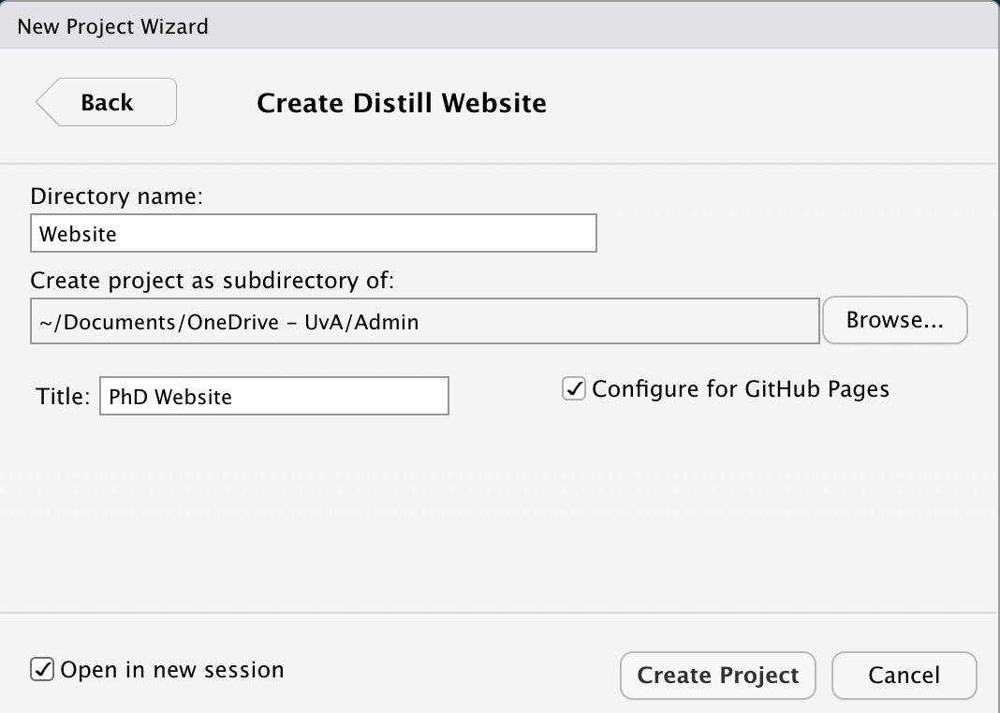

# Introduction

Like anything, creating a website with R Studio has it's own pros and cons. I'll quickly discuss what they are for me, but keep in mind that it may be different for you depending on your [background knowledge](#background-knowledge).

🟢 Easy integration with R Markdown <br>
🟢 One place for your public slides/analyses/scripts/reports <br>
🟢 Version control with Github Pages <br>
🟢 Free hosting with Github Pages <br>
🟢 Automatic linking and chronologic blogposts <br>
🟠 Customization if fully possible, but not intuitive <br>
🔴 Experience with R Studio <br>
🔴 Less intuitive than, for example, wordpress environments <br>

I am personally aware of three different packages for creating your website with R Studio:

1. [R Markdown websites](https://rmarkdown.rstudio.com/lesson-13.html)
1. [Hugo](https://gohugo.io/) & [Blogdown](https://bookdown.org/yihui/blogdown/)
1. [Distill](https://rstudio.github.io/distill/website.html)

Each of these methods has their own syntax, file structures, and customization options. I first created my website with *Hugo*/*Blogdown*, but in the end was unable to easily keep it up-to-date. For me the biggest issue was the file structure which I did not find entirely intuitive, especially when updating my website only once every few months. *Distill* is much more intuitive to use, but slightly limited in the types of pages you can create. For now it suffices my needs, and I already found some packages that will help me achieve pages similar to *Hugo's* widgets.

# Background Knowledge {#background-knowledge}

This tutorial is suitable for you if you..

* ... have [R](https://cloud.r-project.org/) and [R Studio](https://www.rstudio.com/products/rstudio/download/#download) installed
* ... know how to install R packages
* ... have a [Github](https://github.com/) account
* ... know how to use your Terminal (Mac) / Command Prompt (Windows)
* ... have basic knowledge of [Git](https://git-scm.com/docs)

I will try and describe the steps as detailed as possible. However, I will not include directions such as "upper-right corner" because user interfaces are known to change. Instead I expect you to know how to work each of the elements/programs discussed above.

# Creating the Website

> **Objective**: Creating an empty/shell website

*Distill* has excellent [documentation](https://rstudio.github.io/distill/website.html) available. Some of the steps I describe here will also be included in their documentation with more/less detail.

**R Studio**

1. Install the [`Distill`](https://rstudio.github.io/distill/) package:  
    ```{r, echo = TRUE, eval = FALSE}
    install.packages("distill")
    ```
1. Create a new R Studio project 
    (`New Project...` > `New Directory` > `Distill Website`)  

    ```{r, echo = FALSE, eval = TRUE, preview = TRUE}
    
    ```

  * `Directory name`: the name of the folder that is automatically created for this new project. I named mine 'Website'.
  * `Create project as a subdirectory of...`: the folder where you want to store your website. I stored mine in the 'Admin' folder.
  * `Title`: the name of your website which is shown in the 'header' of your website. This can easily be adjusted later on.
  * `Configure for Github Pages`: please select this option as it prevents some manual steps later on.
  * `Open in new session`: I chose to start this project with a new/fresh R Studio session, but this is not a mandatory step.

1. Build the website:
    ```{r, echo = TRUE, eval = FALSE}
    rmarkdown::render_site()
    ```

> **Outcome**: All `.Rmd` files have now been converted to `.html` files and have been linked together with a menu-bar. Your empty/shell website is available to you locally in the `docs` folder of your project.

# Creating a Github Page

> **Objective**: Making your website available online.

In order to put your website online it must be hosted. I like to envision 'hosting' as a town (the provider) in an online world. I have opted to use the provider [Github Pages](https://pages.github.com/) because (1) it is free and (2) it forces me to version control my website. Other options are available, which are discussed in more detail in this *Distill* [article](https://rstudio.github.io/distill/publish_website.html).

**Github**  

1. Create a new  - **empty and public** - repository. Note the name must follow this convention for the Github Pages to work (cf. the [Github Pages documentation](https://pages.github.com/)):

      ```
      USERNAME.github.io
      ```


**Terminal / Command Prompt**  

1. Open a new terminal at the folder where you stored your website
1. Initialize git for the folder  
      ```{bash, eval = FALSE, echo = TRUE}
      git init
      ```
      
1. Add all files currently in the folder  
    ```{bash, eval = FALSE, echo = TRUE}
    git add -A
    ```
1. Commit the files with a commit message 
    ```{bash, eval = FALSE, echo = TRUE}
    git commit -m "Initialize Website"
    ```
1. Create the main branch  
    ```{bash, eval = FALSE, echo = TRUE}
    git branch -M main
    ```
1. Connect your local folder and the Github Repository  
    ```{bash, eval = FALSE, echo = TRUE}
    git remote add origin https://github.com/SHogenboom/shogenboom.github.io.git
    ```
1. Push the local files to the Github Repository  
    ```{bash, eval = FALSE, echo = TRUE}
    git push -u origin main
    ```

**Github**  

* Open `Settings` > `Pages`
* Change the `source` of the page to the sub-folder `/docs`. This tells your Github Pages that it should look for the `index.html` file in the `docs` folder.  

**Terminal / Command Prompt**  

* The previous step on Github has made changes to the repository (`CNAME`). These need to be pulled to your local instance of the repository
    ```{bash, eval = FALSE, echo = TRUE}
    git pull
    ```

**Web browser**  

* Your website is now online @ `https://USERNAME.github.io`

# Adding a Profile Page

> **Objective**: Converting your homepage to a profile landing page

You can make your homepage (`index.html`) anything you want. I wanted a sort of landing page with basic information about me. In the *Distill* documentation I learned about the *postcards* package which is a very easy way of creating profile pages. Before you continue with the tutorial, take a look at their [documentation](https://github.com/seankross/postcards) to choose your profile page theme.

**Local**

1. Choose a picture or logo you want to include on your profile page
1. Save the image in the website project. I chose to create a new folder `images` with the file `avatar.jpg` in it.

**R Studio**  

1. Create a new postcard:  
    ```{r, eval = FALSE, echo = TRUE}
    postcards::create_postcard(file = "tmp.Rmd",
                               template = "jolla")
    ```  
    
1. Copy the `yaml` header from `tmp.Rmd` to the `index.Rmd` file and update with your personal information. My header now looks like this:  

    ```{yaml, eval = FALSE, echo = TRUE}
    title: "Sally A.M. Hogenboom"
    image: "images/avatar.jpg"
    links:
      - label: GitHub
        url: "https://github.com/SHogenboom"
      - label: Email
        url: "mailto:s.a.m.hogenboom@uva.nl"
    output:
      postcards::jolla
    site: distill::distill_website
    ```

1. You can now remove the `tmp.Rmd` file again - we no longer need it!
    
1. Re-build the website  
    ```{r, eval = FALSE, echo = TRUE}
    rmarkdown::render_site(encoding = 'UTF-8')
    ```

**Terminal**  

* Add all the files/changes  
    ```{bash, eval = FALSE, echo = TRUE}
    git add -A
    ```
    
* Add an informative message for the version control  
    ```{bash, eval = FALSE, echo = TRUE}
    git commit -m "Add profile page"
    ```
* Push the changes so they show up online  
    ```{bash, eval = FALSE, echo = TRUE}
    git push
    ```
    
