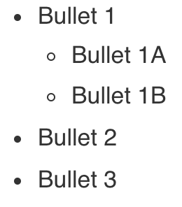

# Background Knowledge

This tutorial is relevant for you if you..

* ... have [R](https://cloud.r-project.org/) and [R Studio](https://www.rstudio.com/products/rstudio/download/#download) installed
* ... know how to install R packages
* ... have a [Github](https://github.com/) account
* ... know how to use your Terminal / Command Prompt
* ... have basic knowledge of [Git](https://git-scm.com/docs)

I will try and describe the steps as detailed as possible. However, I will not include directions such as "upper-right corner" because user interfaces are known to change. 

# Creating the Website

> **Objective**: Creating an empty/shell website

There are multiple ways in which you can use the R Studio environment for creating websites. I have personally tried two alternatives: `Hugo`/`Blogdown` and `Distill`. In this tutorial I will describe the process of creating a Distill based website, as I found it to be the most intuitive and easy-to-use of both alternatives.

`Distill` has excellent [documentation](https://rstudio.github.io/distill/website.html) available. Some of the steps I describe here will also be included in their documentation, but I will try and go beyond what they have already described.

1. Open `R Studio`  
1. Install the [`Distill`](https://rstudio.github.io/distill/) package:  
    ```{r, echo = TRUE, eval = FALSE}
    install.packages("distill")
    ```
1. Create a new R Studio project 
    (`New Project...` > `New Directory` > `Distill Website`)  

    ```{r, echo = FALSE, eval = TRUE}
    knitr::include_graphics("images/new-distill-project.png")
    ```

  * `Directory name`: the name of the folder that is automatically created for this new project. I named mine 'Website'.
  * `Create project as a subdirectory of...`: the folder where you want to store your website. I stored mine in the 'Admin' folder.
  * `Title`: the name of your website which is shown in the 'header' of your website. This can easily be adjusted later on.
  * `Configure for Github Pages`: please select this option as it prevents some manual steps later on.
  * `Open in new session`: I chose to start this project with a new/fresh R Studio session, but this is not a mandatory step.

1. Build the empty/shell website:
    ```{r, echo = TRUE, eval = FALSE}
    rmarkdown::render_site()
    ```

# Creating a Github Page

> **Objective**: Putting the Website Online

In order to put your website online it must be hosted. I like to envision 'hosting' as a town (the provider) in an online world. I have opted to use the provider [Github Pages](https://pages.github.com/) because (1) it is free (!) and (2) it forces me to version control my website.

**Github**
1. Create a new  - **empty and public** - repository:
    ```
    USERNAME.github.io
    ```

**Terminal**
1. Open a new terminal at the folder where you stored your website
1. Initialize git for the folder
    ```
    git init
    ```
1. Add all files
    ```
    git add -A
    ```
1. Commit the files
    ```
    git commit -m "Initialize Website"
    ```
1. Create the main branch
    ```
    git branch -M main
    ```
1. Connect the folder and the Github Repository
    ```
    git remote add origin https://github.com/SHogenboom/shogenboom.github.io.git
    ```
1. Push the local files to the Github Repository
    ```
    git push -u origin main
    ```

**Github**
* Open `Settings` > `Pages`
* Change the `source` of the page to the sub-folder `/docs`

**Terminal**
* Pull the changes that were made to the repository (`CNAME`)

**Web browser**
* Your website is now online @ `https://USERNAME.github.io`

# Adding a Profile Page

> **Objective**: Converting your homepage to a profile page

I wanted people to land on a sort of 'Home' page with some basic profile information. Luckily, the Distill documentation clearly describes how you can use the `postcards` package to create a profile/landing page.

Before you get started, check out the `postcards` [documentation](https://github.com/seankross/postcards) to see the profile pages from which you can choose.

**R Studio**
1. Create a new postcard:
    ```
    postcards::create_postcard(file = "home.Rmd",template = "jolla")
    ```
1. Copy the `yaml` header to the `index.Rmd` file and update with your personal information. My header now looks like this:
    ```
    title: "Sally A.M. Hogenboom"
    image: "images/avatar.jpg"
    links:
      - label: GitHub
        url: "https://github.com/SHogenboom"
      - label: Email
        url: "mailto:s.a.m.hogenboom@uva.nl"
    output:
      postcards::jolla
    site: distill::distill_website
    ```
1. Re-build the website
    ```
    rmarkdown::render_site(encoding = 'UTF-8')
    ```

**Terminal**
* Add the changes
    ```
    git add -A
    ```
* Add an informative message for the version control
    ```
    git commit -m "Add profile page"
    ```
* Push the changes so they show up online
    ```
    git push
    ```
    


# Custom Styling

I really love the Distill framework but have opted to make some custom styling changes. The process of adding custom styling (CSS) to your website is described in detail in their [documentation](https://rstudio.github.io/distill/website.html?panelset1=theme.css&panelset2=theme.css2#theming). 

In my own words the steps were as follows:

* Open `R Studio`
* Open your website project
* Create a new theme from the `Console`:
  ```{r, echo = TRUE, eval = FALSE}
  distill::create_theme()
  ```
* Add the custom css file to your website:
  * Open `_site.yml`
  * Change the output format to (keep the tab indents!):
  ```
  output:
    distill::distill_article:
      theme: theme.css
  ```
* Update the `theme.css` file as desired (see example changes below)

## Adjustments

If you also want to make the adjustments shown below, add the displayed CSS code to the `theme.css` file.

```{r panelset, echo=FALSE, eval=TRUE}
# Allows for the use of panels
xaringanExtra::use_panelset()
```

### Reduce the spacing between bullet-points

::: {.panelset}
::: {.panel}

#### Before

```{r, eval = TRUE, echo = FALSE}
knitr::include_graphics("images/bullet_old.png")
```

:::

::: {.panel}

#### After

```{r, eval = TRUE, echo = FALSE}

```
:::
  
::: {.panel}

#### CSS

```{css, eval = FALSE}
/* Decrease spacing between elements of bullet lists */
/* 0.1em creates a small space between lines of text dependent on the font-size*/
d-article li, d-article ul, di-article ol {
  margin-bottom: 0.1em;
}
```

:::
:::

# Custom URL

* buy it

**Github**

1. Open `Settings` > `Pages`
1. In the `custom domain` field add the URL you have purchased. 
1. Your website is now accesible from the custom URL.
