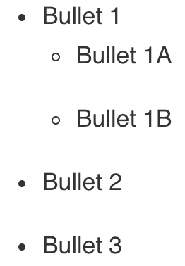

# Custom Styling  

I really love the Distill framework but have opted to make some custom styling changes. The process of adding custom styling (CSS) to your website is described in detail in their [documentation](https://rstudio.github.io/distill/website.html?panelset1=theme.css&panelset2=theme.css2#theming). 

In my own words the steps were as follows:  

**R Studio** 

* Create a new theme:
  ```{r, echo = TRUE, eval = FALSE}
  distill::create_theme()
  ```
* Add the custom css file to your website:
  * Open `_site.yml`
  * Change the output format to (keep the tab indents!):
  ```
  output:
    distill::distill_article:
      theme: theme.css
  ```
* Update the `theme.css` file as desired (see example changes below)

## Adjustments

If you also want to make the adjustments shown below, add the displayed CSS code to the `theme.css` file.

```{r panelset, echo=FALSE, eval=TRUE}
# Allows for the use of panels
xaringanExtra::use_panelset()
```

### Reduce the spacing between bullet-points

::: {.panelset}
::: {.panel}

#### Before

```{r, eval = TRUE, echo = FALSE}

```

:::

::: {.panel}

#### After

```{r, eval = TRUE, echo = FALSE}
knitr::include_graphics("images/bullet_new.png")
```
:::
  
::: {.panel}

#### CSS

```{css, eval = FALSE}
/* Decrease spacing between elements of bullet lists */
/* 0.1em creates a small space between lines of text dependent on the font-size*/
d-article li, d-article ul, di-article ol {
  margin-bottom: 0.1em;
}
```

:::
:::
